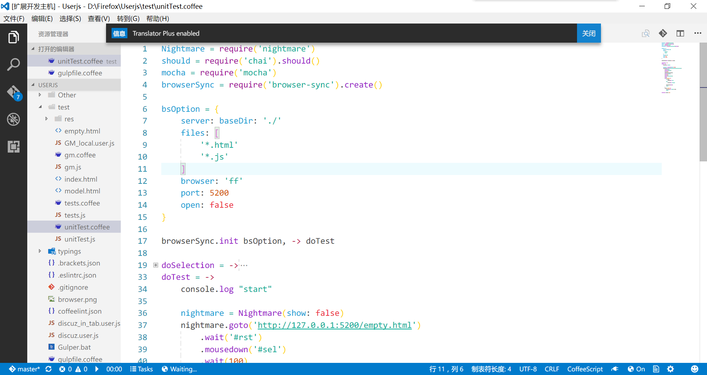

# Translator Plus

> Based on [https://github.com/jianzhichun/vscode-translate] (https://github.com/jianzhichun/vscode-translate)

## Features

Translate your selection using google translation, the result will show up in statusbar.

### How to use:

Press CTRL + T to toggle translator. You can also press "ctrl + shift + p" and search for this command.

Note: will respect "http.proxy" in user-settings.

### Screenshots:

Result in statusbar:

## Extension Settings

This extension contributes the following settings:

* `translatorplus.targetLanguage`: Target language id of translation, leave blank for auto detection. Refer [https://cloud.google.com/translate/docs/languages](https://cloud.google.com/translate/docs/languages) for details.

## My Other extensions:

### [FlatUI](https://marketplace.visualstudio.com/items?itemName=lkytal.FlatUI)
### [Quick Task](https://marketplace.visualstudio.com/items?itemName=lkytal.quicktask)
### [Pomodoro](https://marketplace.visualstudio.com/items?itemName=lkytal.pomodoro)

## Release Notes

### 1.0.0

Initial release.

> 
Icons made by <a href="http://www.flaticon.com/authors/vectors-market" title="Vectors Market">Vectors Market</a> from <a href="http://www.flaticon.com" title="Flaticon">www.flaticon.com</a> is licensed by <a href="http://creativecommons.org/licenses/by/3.0/" title="Creative Commons BY 3.0" target="_blank">CC 3.0 BY</a>

